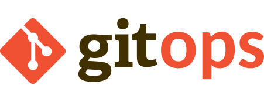

# A Gitops continuous deployment and delivery demonstrator using the Argo projects

 

## Table of contents

- [Description](#description)
- [Installation](#installation)
- [Promotion workflow](#promotion-workflow)
- [Progressive rollout](#progressive-rollout)
- [Run the Demo](#run-the-demo)
- [License](#license)

## Description

A brief description of the project goes here.

## The project structure

The [`argo-projects`](./argo-projects/) folder contains all the manifests for the platform: the Argo CD application/applicationsets, the kubernetes resources for the Argo controllers, the infrastructure and the applications

The [`demo-app`](./demo-app/) folder contains the source code for the PetStore demo application, that we are using to demonstrate the deployment, promotion workflow and progressive rollouts mechanisms.

The [`ui`](./ui/) folder contains the source code for the simple web page allowing to demonstrate the progressive rollout on the production version of the application.

The [`scripts`](./scripts/) folder contains a few usefull scripts that you will use in the next chapters.

The [`workflow-resources`](./workflow-resources/) contains the source code for the steps run during the promotion workflow.

The [doc`](./doc/) folder contains the project documentation.

## Installation

To setup this demonstrator, feel free to **fork this repository** and follow the [installation instructions](doc/PLATFORM_INSTALLATION.md).

## Promotion workflow

See [the promotion workflow doc](doc/PROMOTION_WORKFLOW.md).

## Progressive rollout

See [the progressive rollout doc](doc/PROGRESSIVE_ROLLOUT.md).

## Run the Demo

See [How to run the demo](doc/HOW_TO_RUN_THE_DEMO.md).

## License

This project is licensed under the [Apache License](LICENSE).
