# Run the demo

## PetStore application description

We will run a full continuous deployment and delivery on our demo application: the PetStore 🐶.

This application is a simple Quarkus app located in the [demo-app](https://github.com/OpenGuidou/argo-projects-demo/tree/main/demo-app) folder.

It's exposing a REST API for GET method at the path `/pet`

```java
@Path("/pet")
public class PetResource {

    private Random randomGenerator = new Random();

    @GET
    @Produces(MediaType.TEXT_PLAIN)
    public String pet() {

        // Version 4
        // random 20% chance of failure
        //if (Math.random() * 100  < 20) {
        //    throw new RuntimeException("Random failure");
        //}

        // Version 3
        // random 33% chance of Dog/Cat/Bird
        // int randomInt = randomGenerator.nextInt(3);
        // if (randomInt == 0) {
        //     return "Dog";
        // } else if (randomInt == 1) {
        //     return "Cat";
        // } else {
        //     return "Bird";
        // }

        // Version 2
        //return "Wolf";

        // Version 1
        return "Dog";
    }
}
```

We'll push 4 versions of this application to demonstrate different use cases:

* Version 1: the API always returns "Dog"
* Version 2: the API always returns "Wolf", which is not accepted as a Pet type by the test campaign included in our promotion workflow.
* Version 3: the API returns "Dog", "Cat" or "Bird", which are accepted as Pet types by the test campaign
* Version 3: Version 3 with 20% change to return an HTTP 500 error response

This table explains what is the expected behavior of the delivery mechanisms depending on the version:

| Version      | Promotion Workflow | Canaries in production
|    :----:    |    :----:          |        :----:
| 1            | Success            | Success
| 2            | Failure            |  - not run -
| 3            | Success            | Success
| 4            | Success            | Failure

## Push the different images

You can uncomment part of the code of the `PetResource.java` file to adapt the behavior of the application.

Edit the tag version in the [pom.xml](https://github.com/OpenGuidou/argo-projects-demo/blob/main/demo-app/pom.xml#L27):

```xml
<quarkus.container-image.tag>1.0</quarkus.container-image.tag>
```

Build and push the image:
```bash
mvn deploy
```

## Open the test UI

A small web page allows you to inject request on the production instance, to visualize the behavior of the application.

To open it, go to the [ui folder](https://github.com/OpenGuidou/argo-projects-demo/tree/main/ui) and run:
```bash
npm i && ng serve
```

You should be able to access it at: [http://localhost:4200/](http://localhost:4200/)

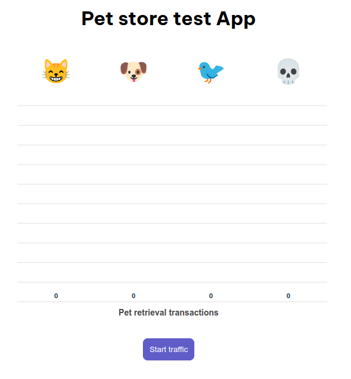

The button start sending request to the production ingress, and the results are displayed in each column:

* Number of cats
* Number of dogs
* Number of birds
* Number of API failures (HTTP 500)

## Run the use-cases

The initial version of the application deployed in test and prod is the 1.0.

### Version 1.0 to 2.0

We start by mimicking the continuous integration by bumping the application in test to 2.0 in [values-test.yaml](https://github.com/OpenGuidou/argo-projects-demo/blob/main/argo-projects/app/manifests/overlays/test/values-test.yaml#L4).

Argo CD should deploy the new version.

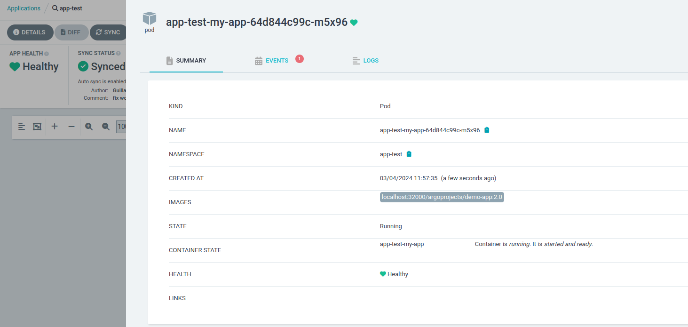

As soon as the `Application` is `Synced` and `Healthy`, the notification will be sent to the Argo Events webhook and trigger the creation of the workflow:

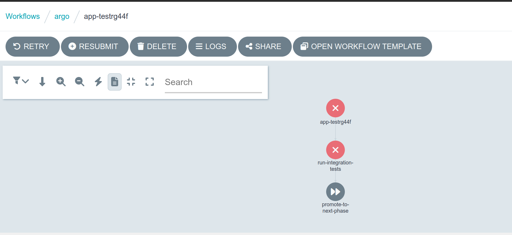

You can see that the integration tests step is Red as it failed. The promotion step was skipped in that case.

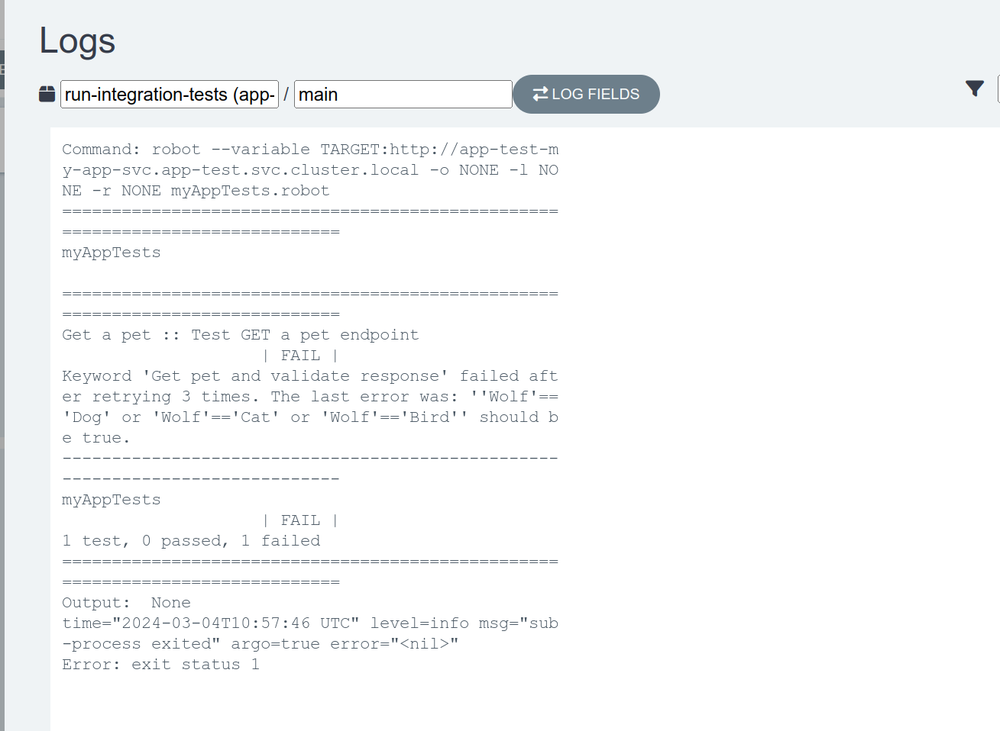

You can check the execution logs and see that *Wolf* is not an accepted Pet value.

### Version 2.0 to 3.0

Start by injecting traffic on production using the UI. You should see only dogs for now:

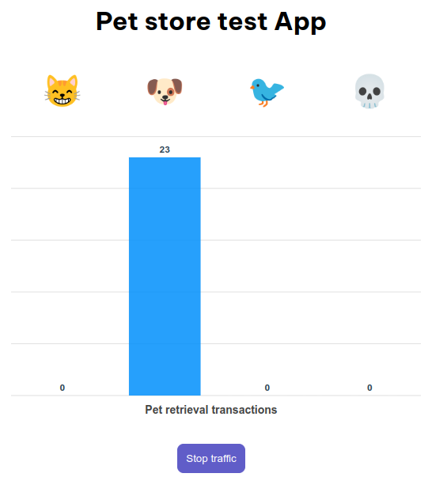

Once the test app bumbed to 3.0, the workflow triggered is successful:

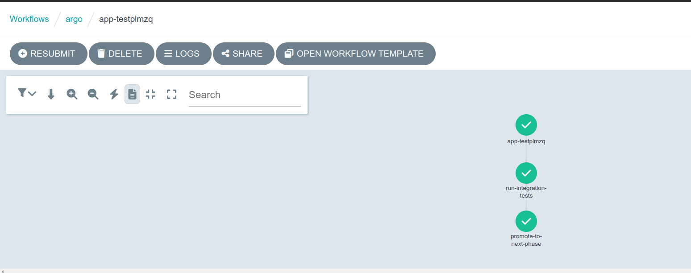

We can verify that the application has been promoted to production in the git repository:

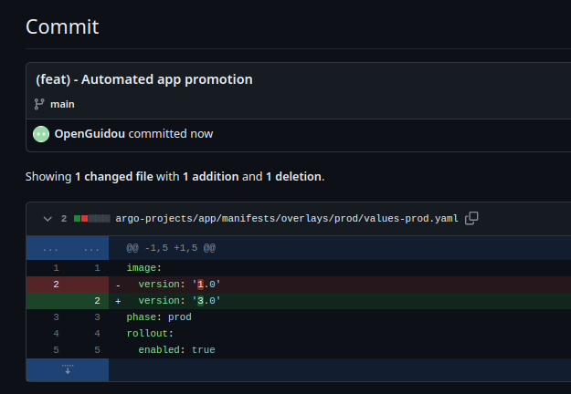

As we have activated the rollout in production, the application state reflects the pause the canary strategy is implementing:

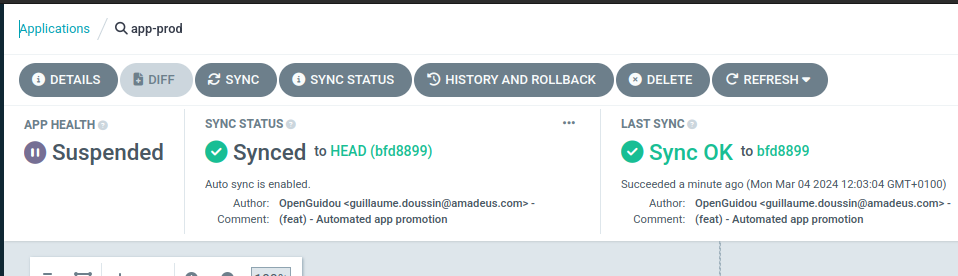

We can go in Argo Rollouts dashboard to follow the canary process:

```bash
kubectl argo rollouts dashboard
```

Then browse at: [http://localhost:3100/rollouts/rollout/app-prod/app-prod-my-app-rollout](http://localhost:3100/rollouts/rollout/app-prod/app-prod-my-app-rollout) 

In the UI, we can notice dogs, cats and birds now being returned:

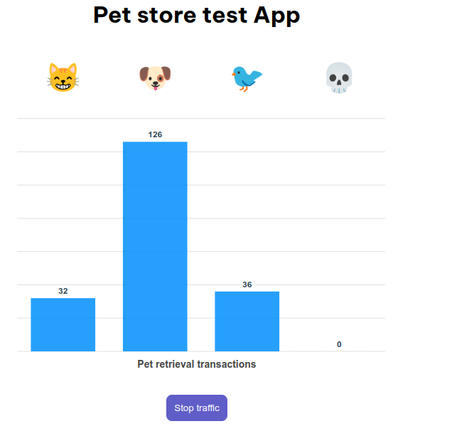

And the canary process is finally successful, the analysis having succeeded:

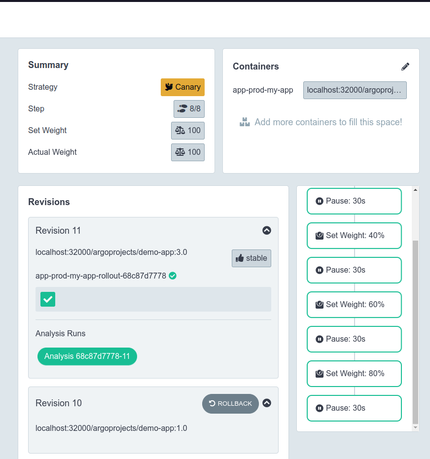

The application state in Argo CD reflects that success, the application being now Synced and Healthy:

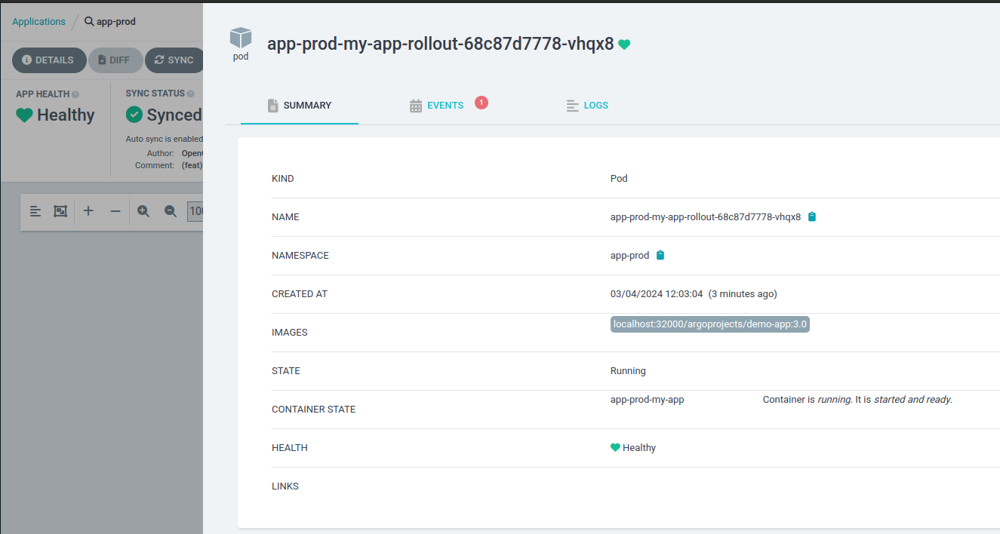

### Version 3.0 to 4.0

Continue to inject traffic from the UI, and bump the application to 4.0 in test.

The promotion should be successful between test and prod, and the canary process will start again.

This time, we can notice from the UI some errors being returned:

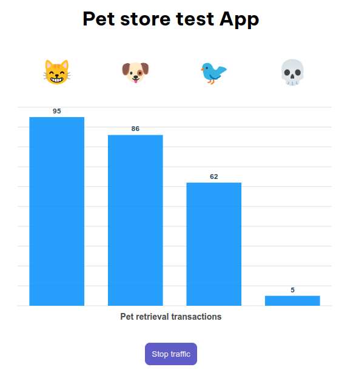

The Rollout analysis is able to detect those new errors, and fails:

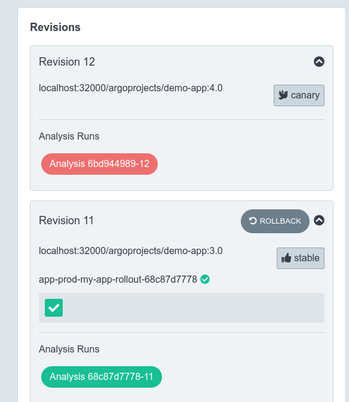

The traffic is switched back entirely to the 3.0, resolving the issue for the end-users.

In Argo CD, the application state reflects that by setting the health to Degraded, and we can see that we are still on the 3.0 version:

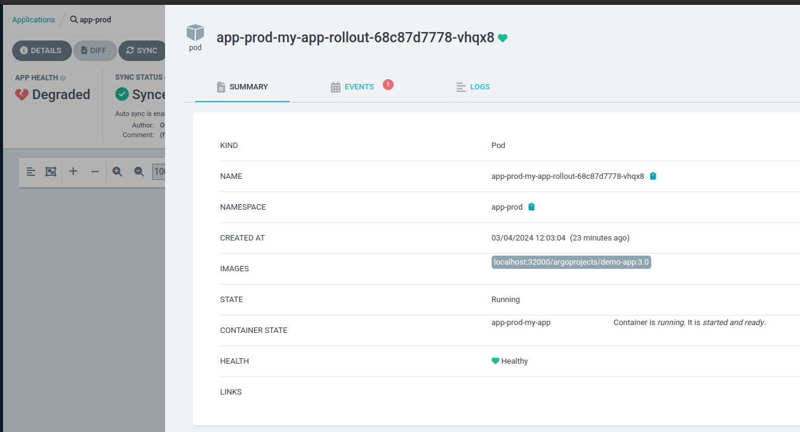