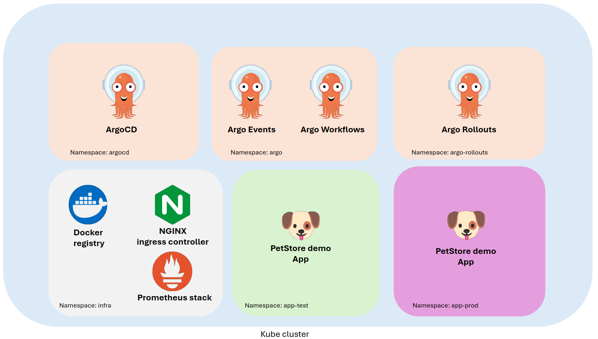
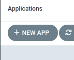
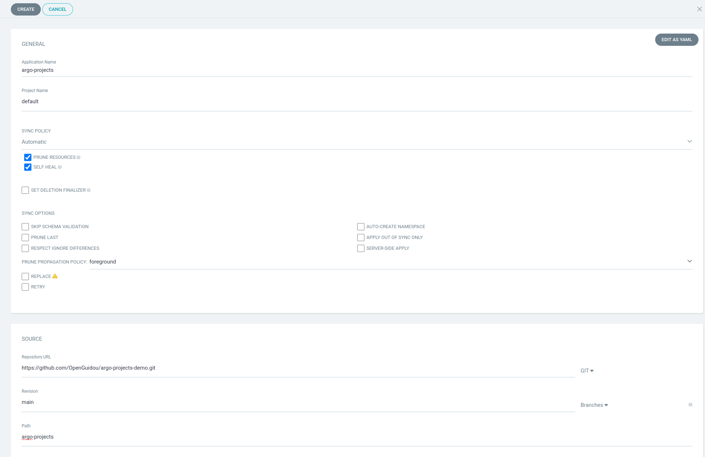
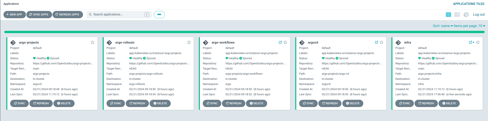

# Platform installation

## Pre-requisistes

To be able to install the platform and its components, you need first a kubernetes cluster running.

You can use [k3d](https://k3d.io/), [minikube](https://minikube.sigs.k8s.io/docs/start/) or [kind](https://kind.sigs.k8s.io/docs/user/quick-start/) for example.

You will also need:

* [kubectl](https://kubernetes.io/docs/tasks/tools/install-kubectl/)
* [Argo CD CLI](https://argo-cd.readthedocs.io/en/stable/getting_started/#2-download-argo-cd-cli)
* [Argo Rollouts Kubectl plugin](https://argo-rollouts.readthedocs.io/en/stable/features/kubectl-plugin/)

To compile and deploy the demo application, you will need:

* Maven 3.9
* JDK 17

You can install both using [SDKMAN!](https://sdkman.io/).

To run the production web page, you will need:
* npm (~10.1.0): you can install using https://github.com/nvm-sh/nvm 
* angular-cli (~17.1.3): 
    ```bash
    npm install -g @angular/cli
    ```


## Platform components

In your kubernetes cluster, we'll start by installing Argo CD.

```bash
./scripts/install-argo-cd.sh
```

Once installed, we'll use Argo CD to deploy absolutely everything in the cluster. It will even watch and patch itself !



Using Argo CD, we will deploy some infrastructure components:

* [Ingress Nginx controller](https://github.com/kubernetes/ingress-nginx): to be able to expose ingresses to the Argo CD and Argo Workflows interfaces, and also act as a load balancer for our canary tests using Argo Rollouts
* [Docker-registry](https://artifacthub.io/packages/helm/phntom/docker-registry): to handle and serve our microservice images
* [Prometheus stack](https://github.com/prometheus-community/helm-charts/tree/main/charts/kube-prometheus-stack): to gather microservice's prometheus metrics and use them as analysis in our progressive rollout

It will also take care of installing the Argo Projects:

* [Argo CD](https://argo-cd.readthedocs.io/en/stable/), patching itself !
* [Argo Workflows](https://argo-workflows.readthedocs.io/en/latest/)
* [Argo Events](https://argoproj.github.io/argo-events/)
* [Argo Rollouts](https://argo-rollouts.readthedocs.io/en/stable/)

And a PetStore demo application in two phases: test and production.

## Components installation

Once the Argo CD installation run, you can access the UI with a simple port-forward:

```bash
kubectl port-forward svc/argocd-server -n argocd 8080:80
```

This is only needed as long as we have not patched the installation with an additional ingress.

You can now access the Argo CD interface at "http://localhost:8080".
You can connect using the "admin" user and the password retrieved by executing the command:

```bash
argocd admin initial-password -n argocd
```

You can now create an application using the 'New App' button.



You can use the following parameters as reference:



You should now have all components deployed in your cluster:



*/!\ Do not mind the app namespaces in red, we'll push the application image in the step just after.*

**This is it**. This was the last manual action you had to perform on the platform !

## Push the PetStore demo app images

Go into the `demo-app` folder and simply run:
```bash
mvn deploy
```

The test and prod applications should turn green now.

## Access the UI

You can now access the UI at:

- Argo CD: [https://argocd.127.0.0.1.nip.io/](https://argocd.127.0.0.1.nip.io/)
- Argo Workflows (+ Events): [https://argo-workflows.127.0.0.1.nip.io/workflows](https://argo-workflows.127.0.0.1.nip.io/workflows)

### Troubleshooting

In case the ArgoCD UI doesn't load (too many redirects), you might need to restart the argo-server pod to take into account the latest options.

```bash
kubectl rollout restart deployment argocd-server -n argocd
```

If some pods are in CrashLoop state with the error `Too many open files`, try:

```bash
sudo sysctl fs.inotify.max_user_instances=1280
sudo sysctl fs.inotify.max_user_watches=655360
```
Ref: [https://github.com/kubeflow/manifests/issues/2087](https://github.com/kubeflow/manifests/issues/2087)