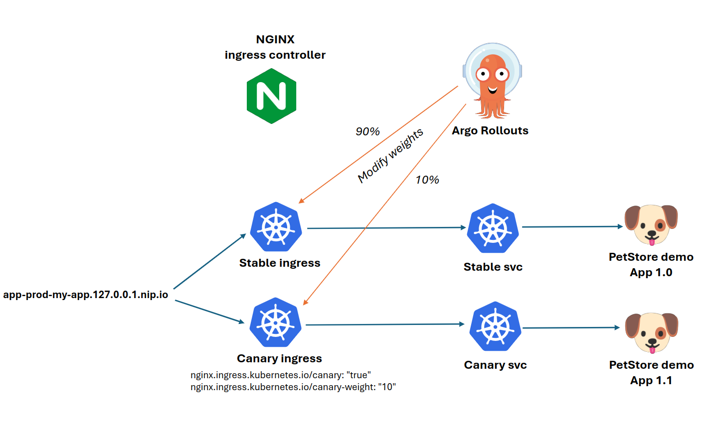

# Progressive rollout

## Description

No matter how good the automated test campaign is, some issues will always be spotted in production, as users tend to not use the application the way we intend them to.

It is important to be minimize the impact of this issue for the end-users.

To achieve that, we'll use Argo Rollouts to perform canary testing when deploying a new version of the application.

We will route only a few percent of the production traffic to the new version, and launch an analysis to detect if some errors are occuring on this canary, and not the current production version.

If so, we'll rollback automatically to the production version, otherwise, we can continue to increase progressively the canary traffic percentage until we reach 100%.



The Canary Ingress is deployed and controlled by Argo Rollouts controller.


## Implementation

### The Rollout resource

For Argo Rollouts to be able to control the deployment, we start by using the [Rollout resource](https://argo-rollouts.readthedocs.io/en/stable/features/specification/).

This resource only references the existing `Deployment` and adds the progressive rollout strategy and analysis.

If you look at the [demo app helm chart](https://github.com/AmadeusITGroup/argo-projects-demo/blob/main/argo-projects/app/manifests/base/templates/deployment.yaml), we set the replicas to 0 on the `Deployment` when the Rollout is used, so that the Rollout can control the execution.:

```yaml
spec:
  {{- if not .Values.autoscaling.enabled }}
  replicas: {{ if .Values.rollout.enabled }}0{{ else }}{{ .Values.replicaCount }}{{ end }}
  {{- end }}
```

And reference the Deployment in the Rollout resource:

```yaml
{{- if .Values.rollout.enabled }}
---
apiVersion: argoproj.io/v1alpha1
kind: Rollout
metadata:
  name: {{ include "my-app.fullname" . }}-rollout
  labels:
    {{- include "my-app.labels" . | nindent 4 }}
spec:
  {{- if not .Values.autoscaling.enabled }}
  replicas: {{ .Values.replicaCount }}
  {{- end }}
  analysis:
    successfulRunHistoryLimit: {{ .Values.rollout.successfulRunHistoryLimit }}
    unsuccessfulRunHistoryLimit: {{ .Values.rollout.unsuccessfulRunHistoryLimit }}
  selector:
    matchLabels:
      {{- include "my-app.selectorLabels" . | nindent 6 }}
  workloadRef: # Reference to the deployment
    apiVersion: apps/v1
    kind: Deployment
    name: {{ include "my-app.fullname" .  }} 
  revisionHistoryLimit: {{ .Values.rollout.revisionHistoryLimit }}
  strategy: 
    {{ toYaml .Values.rollout.strategy | nindent 4 }}
{{- end }}
```

The rollout is activated from prod only in the [production values](https://github.com/AmadeusITGroup/argo-projects-demo/blob/main/argo-projects/app/manifests/overlays/prod/values-prod.yaml#L5):

```yaml
rollout:
  enabled: true
```

### The traffic split management

We'll use the Nginx ingress-controller [deployed previously](./PLATFORM_INSTALLATION.md#platform-components) to split the traffic between production and canaries.

Corresponding documentation [here](https://argo-rollouts.readthedocs.io/en/stable/features/traffic-management/nginx/).

Argo Rollouts takes care of creating and managing the canary ingress. We just need to define a `Service` for the canaries. We can deploy it only if the rollout is enabled:

```yaml
apiVersion: v1
kind: Service
metadata:
  name: {{ include "my-app.fullname" . }}-canary-svc
  labels:
    {{- include "my-app.labels" . | nindent 4 }}
spec:
  ports:
    - name: http
      port: 80
      targetPort: 8080
    - name: metrics
      port: 9000
      targetPort: 9000
  selector:
    {{- include "my-app.selectorLabels" . | nindent 4 }}
{{ end }}
```

Argo Rollouts controller will also take care of adding the canary hashset in the selectors, to only route the traffic there.

Source [here](https://github.com/AmadeusITGroup/argo-projects-demo/blob/main/argo-projects/app/manifests/base/templates/service.yaml#L24).


### The analysis

To ensure that the new application doesn't introduce new errors, we'll define an AnalysisTemplate comparing the demo app's HTTP service success codes.

This is a very simple use validation, but you could think about extending it to any metric or information available around your application.

```yaml
apiVersion: argoproj.io/v1alpha1
kind: ClusterAnalysisTemplate
metadata:
  name: http-server-success-rate-comparison
spec:
  args:
  - name: container-name
  - name: stable-hash
  - name: latest-hash
  metrics:
  - name: success-rate
    interval: 30s # Run every 30 seconds
    # NOTE: prometheus queries return results in the form of a vector.
    # So it is common to access the index 0 of the returned array to obtain the value
    successCondition: len(result) == 0 || isNaN(result[0]) || result[0] <= 0
    failureLimit: 0
    provider:
      prometheus:
        address: http://prometheus-operated.infra.svc.cluster.local:9090 # the local prometheus instance
        query: |
          (
            sum(
              irate(
                http_server_requests_seconds_count{container="{{args.container-name}}",pod=~"{{args.container-name}}-rollout-{{args.stable-hash}}.*",outcome=~"SUCCESS"}[30s]
              )
            ) 
            /
            sum(
              irate(
                http_server_requests_seconds_count{container="{{args.container-name}}",pod=~"{{args.container-name}}-rollout-{{args.stable-hash}}.*"}[30s]
              )
            )
          ) -
          (
            sum(
              irate(
                http_server_requests_seconds_count{container="{{args.container-name}}",pod=~"{{args.container-name}}-rollout-{{args.latest-hash}}.*",outcome=~"SUCCESS"}[30s]
              )
            ) 
            /
            sum(
              irate(
                http_server_requests_seconds_count{container="{{args.container-name}}",pod=~"{{args.container-name}}-rollout-{{args.latest-hash}}.*"}[30s]
              )
            )
          )
```
Source [here](https://github.com/AmadeusITGroup/argo-projects-demo/blob/main/argo-projects/argo-rollouts/resources/analysis-templates.yaml).

It's taking as argument the production (stable) and the canary replicaset hashes, to be able to run Prometheus queries and compare their results.

Here the operation compute the success rate of each (success transactions rate over total transaction rate) and substract the canary to the production.

If the result if less or equals to zero, it means that the canary didn't raise more errors than the production.

### The Rollout canary strategy

In the Rollout strategy, we can now reference all the different pieces together.

The analysis will run here [in the background](https://argo-rollouts.readthedocs.io/en/stable/features/analysis/#background-analysis).

We'll start from 20% of the traffic on the canary, and increase progressively. The Rollout may stop if the analysis fails at any moment during the execution.

```yaml
  strategy:
    canary:
      analysis:
        # Arguments taken by the Analysis
        args:
        - name: container-name
          value: app-prod-my-app
        - name: stable-hash
          valueFrom:
            podTemplateHashValue: Stable
        - name: latest-hash
          valueFrom:
            podTemplateHashValue: Latest
        templates:
        - clusterScope: true
          templateName: http-server-success-rate-comparison # Ref to the AnalysisTemplate
      canaryService: app-prod-my-app-canary-svc # Ref the canary service defined earlier
      scaleDownDelaySeconds: 3
      stableService: app-prod-my-app-svc # Ref to the production service
      steps: # Canary steps
      - setWeight: 20
      - pause:
          duration: 30s
      - setWeight: 40
      - pause:
          duration: 30s
      - setWeight: 60
      - pause:
          duration: 30s
      - setWeight: 80
      - pause:
          duration: 30s
      trafficRouting:
        nginx:
          stableIngress: app-prod-my-app-ingress # Ref to the production ingress
```

Source [here](https://github.com/AmadeusITGroup/argo-projects-demo/blob/main/argo-projects/app/manifests/overlays/prod/values-prod.yaml#L6).