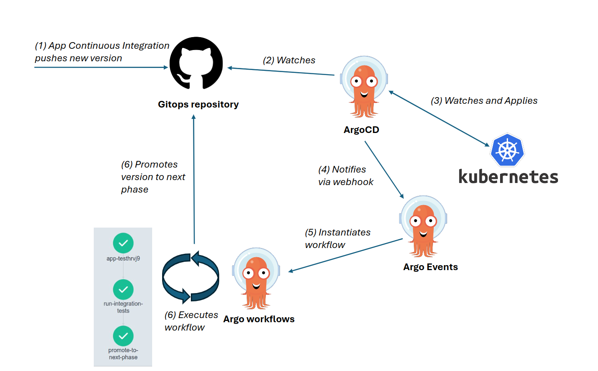

# Promotion workflow

## Description

To implement the continuous delivery pattern, we need to be able to deploy our new application version to a validation phase (test for this demo), run some tests and if everything is fine, promote this version to the next phase (prod for this demo).

We can easily implement that combining ArgoCD (and its notifications), Argo Events and Argo Workflows.



As soon as a new version is pushed by the CI to this GitOps repository, Argo CD detects it and applies the new version to the test namespace.

Argo CD sends then a notification when the synchronization is completed, and the status of the application is `Healthy`.

This notification reaches an Argo Events' webhook EventSource, triggering as action an Argo Workflow.

This Workflow is composed of two steps:

* Run tests
* Promote application to the next phase (commit the version in git, in the next phase's values)

This loop can be repeated for as many software phases as you may have (dev, test, staging, prod, etc.).

## Implementation

We'll start by the end of the promotion loop and go back step by step up the trigger chain.

### Configuring Argo Workflows

The first step is to define the workflow to execute to validate that the new application deployed doesn't break any functional flow, and promote it to the next phase if successful.

We define one `WorkflowTemplate` per action (test, promote), and combine them in another workflow to chain both actions. We are defining them at cluster scope (`ClusterWorkflowTemplate`), to be able to use them in different namespaces.

Those templates will be instantiated by Argo Events upon the reception of specific notifications.

#### Tests workflow
```yaml
apiVersion: argoproj.io/v1alpha1
kind: ClusterWorkflowTemplate
metadata:
  name: workflow-template-run-integration-tests
spec:
  entrypoint: integration-tests
  podGC:
    strategy: OnPodSuccess
  templates:
    - name: integration-tests
      inputs:
        parameters:
          - name: test_target
          - name: test_docker_image
          - name: test_docker_command
      container:
        image: "localhost:32000/{{inputs.parameters.test_docker_image}}"
        resources:
          requests:
            memory: 1Gi
          limits:
            memory: 2Gi
        command:
          - "{{inputs.parameters.test_docker_command}}"
        args:
          - "{{inputs.parameters.test_target}}"
```

This workflow executes a robot framework test campaign located [here](https://github.com/AmadeusITGroup/argo-projects-demo/tree/main/workflow-resources/test-campaign), validating that the application returns a valid Pet on its endpoint.


#### Git promotion workflow:

```yaml
apiVersion: argoproj.io/v1alpha1
kind: ClusterWorkflowTemplate
metadata:
  name: workflow-template-promote-to-next-phase
spec:
  entrypoint: promotion
  podGC:
    strategy: OnPodSuccess
  templates:
    - name: promotion
      inputs:
        parameters:
          - name: git_repo
          - name: source_commit
          - name: source_phase
          - name: target_phase
          - name: git_credentials_secret
      container:
        image: localhost:32000/argo-projects/git-promotion:latest
        command:
          - "python3"
          - "promote.py"
        args:
          - "--git-repo"
          - "{{inputs.parameters.git_repo}}"
          - "--source-commit"
          - "{{inputs.parameters.source_commit}}"
          - "--source-phase"
          - "{{inputs.parameters.source_phase}}"
          - "--target-phase"
          - "{{inputs.parameters.target_phase}}"
        env:
          - name: GIT_USER
            valueFrom:
              secretKeyRef:
                name: "{{inputs.parameters.git_credentials_secret}}"
                key: username
          - name: GIT_PASSWORD
            valueFrom:
              secretKeyRef:
                name: "{{inputs.parameters.git_credentials_secret}}"
                key: password
          - name: GIT_EMAIL
            valueFrom:
              secretKeyRef:
                name: "{{inputs.parameters.git_credentials_secret}}"
                key: email
```

The workflow executes a small [python script](https://github.com/AmadeusITGroup/argo-projects-demo/tree/main/workflow-resources/git-promotion) pushing the application version from the "source_folder" on the commit hash "source_commit" to the "target_folder" on the "main" branch.

In more pratical terms, it'll align the version from the test phase defined [here](https://github.com/AmadeusITGroup/argo-projects-demo/blob/main/argo-projects/app/manifests/overlays/test/values-test.yaml#L4), to the production phase defined [here](https://github.com/AmadeusITGroup/argo-projects-demo/blob/main/argo-projects/app/manifests/overlays/prod/values-prod.yaml#L2).

The fact to take the synchronization commit hash as parameter ensures you are promoting the application version that was tested before, in case a new commit would bump it in test during the process.

#### The workflow combining both

```yaml
apiVersion: argoproj.io/v1alpha1
kind: ClusterWorkflowTemplate
metadata:
  name: workflow-template-validate-then-promote
spec:
  entrypoint: validate-then-promote
  podGC:
    strategy: OnPodSuccess
  arguments:
    parameters:
      - name: test_target
      - name: test_docker_image
      - name: test_docker_command
      - name: git_repo
      - name: source_commit
      - name: source_phase
      - name: target_phase
      - name: git_credentials_secret
  templates:
    - name: validate-then-promote
      dag:
        tasks:
          - name: promote-to-next-phase
            depends: "run-integration-tests"
            templateRef:
              name: workflow-template-promote-to-next-phase
              clusterScope: true
              template: promotion
            arguments:
              parameters:
                - name: git_repo
                  value: "{{workflow.parameters.git_repo}}"
                - name: source_commit
                  value: "{{workflow.parameters.source_commit}}"
                - name: source_phase
                  value: "{{workflow.parameters.source_phase}}"
                - name: target_phase
                  value: "{{workflow.parameters.target_phase}}"
                - name: git_credentials_secret
                  value: "{{workflow.parameters.git_credentials_secret}}"
          - name: run-integration-tests
            templateRef:
              name: workflow-template-run-integration-tests
              clusterScope: true
              template: integration-tests
            arguments:
              parameters:
                - name: test_target
                  value: "{{workflow.parameters.test_target}}"
                - name: test_docker_image
                  value: "{{workflow.parameters.test_docker_image}}"
                - name: test_docker_command
                  value: "{{workflow.parameters.test_docker_command}}"
```

Sources from [workflow-templates.yaml](https://github.com/AmadeusITGroup/argo-projects-demo/blob/main/argo-projects/argo-workflows/resources/workflow-templates.yaml).


### Configuring Argo Events

Now that we have the workflows defined as templates, we need a trigger to instantiate them.

We'll use an Argo Events [webhook](https://argoproj.github.io/argo-events/eventsources/setup/webhook/) as event source.

```yaml
apiVersion: argoproj.io/v1alpha1
kind: EventSource
metadata:
  name: webhook
spec:
  webhook:
    appSyncSuccess:
      # port to run HTTP server on
      port: "12001"
      # endpoint to listen to
      endpoint: /appSyncSuccess
      # HTTP request method to allow. In this case, only POST requests are accepted
      method: POST
```

And an associated trigger action: a [Sensor triggering an Argo Workflow](https://argoproj.github.io/argo-events/sensors/triggers/argo-workflow/).

```yaml
apiVersion: argoproj.io/v1alpha1
kind: Sensor
metadata:
  name: webhook-app-promotion
spec:
  template:
    serviceAccountName: argo
  dependencies:
    - name: webhook-dep 
      eventSourceName: webhook # Reference to the webhook `EventSource`.
      eventName: appSyncSuccess # Reference to the event inside the webhook.
  triggers:
    - template:
        name: webhook-app-promotion
        k8s:
          operation: create # Create the Workflow resource
          source:
            resource:
              apiVersion: argoproj.io/v1alpha1
              kind: Workflow
              metadata:
                generateName: app-
                labels:
                  scenario: syncSuccess
                  phase: ""
              spec:
                serviceAccountName: argo
                ttlStrategy:
                  secondsAfterCompletion: 43200 # Time to live in seconds after workflow is completed / 12h
                arguments:
                  parameters:
                    - name: test_target
                    - name: source_commit
                    - name: source_phase
                    - name: target_phase
                    - name: test_docker_image
                      value: "argo-projects/test-campaign:latest"
                    - name: test_docker_command
                      value: "./launchTests.sh"
                    - name: git_repo
                      value: "https://github.com/AmadeusITGroup/argo-projects-demo.git"
                    - name: git_credentials_secret
                      value: "github-credentials"
                workflowTemplateRef:
                  name: workflow-template-validate-then-promote # Reference to the workflow to instantiate.
                  clusterScope: true
          parameters: # Workflow parameters read from webhook JSON body.
            - src:
                dependencyName: webhook-dep
                dataTemplate: "{{ .Input.body.test_target }}"
              dest: spec.arguments.parameters.0.value
            - src:
                dependencyName: webhook-dep
                dataTemplate: "{{ .Input.body.source_commit }}"
              dest: spec.arguments.parameters.1.value
            - src:
                dependencyName: webhook-dep
                dataTemplate: "{{ .Input.body.source_phase }}"
              dest: spec.arguments.parameters.2.value
            - src:
                dependencyName: webhook-dep
                dataTemplate: "{{ .Input.body.target_phase }}"
              dest: spec.arguments.parameters.3.value
            - src:
                dependencyName: webhook-dep
                dataTemplate: "{{ .Input.body.source_phase }}"
              dest: metadata.generateName
              operation: append
            - src:
                dependencyName: webhook-dep
                dataTemplate: "{{ .Input.body.source_phase }}"
              dest: metadata.labels.phase
              operation: append
```

With this setup, an HTTP POST to the `webhook-service:12001/appSyncSuccess` will trigger the creation of a Workflow, following the template `workflow-template-validate-then-promote`.

Sources from [Argo Events resources](https://github.com/AmadeusITGroup/argo-projects-demo/tree/main/argo-projects/argo-events/resources).

You can see here that the github credentials are read from the `Secret` called `github-credentials`.
You would usually have that created securely with something like the [External Secret Operator](https://external-secrets.io/latest/).

For the sake of simplicity for this use case, we'll create it manually:

```yaml
apiVersion: v1
kind: Secret
metadata:
  name: github-credentials
  namespace: argo
type: Opaque
data:
  username: <myUser/base64 encoded>
  password: <myPassword/base64 encoded>
  email: <myEmail/base64 encoded>
```

```bash
kubectl apply -f github-credentials.yaml -n argo
```

### Configuring Argo CD notifications

To finish the setup, we need to plug events occuring during Argo CD deployments to trigger the webhook we just defined.

To achieve that, we will use [Argo CD notifications](https://argocd-notifications.readthedocs.io/en/stable/).

We can configure it by patching the ConfigMap `argocd-notifications-cm`.

```yaml
apiVersion: apps/v1
kind: ConfigMap
metadata:
  name: argocd-notifications-cm
data:
  # generic webhook data
  service.webhook.sync-webhook: | # service.<notificiation-type>.<webhook-name>
    url: http://webhook-eventsource.argo.svc.cluster.local:12001 # ref to the webhook service
    headers:
      - name: "Content-Type"
        value: "application/json"
  # Webhook template that you can differentiate for each event inside the webhook, or each phase where you want to run the workflows
  template.sync-success-test: |
    webhook:
      sync-webhook:
        method: POST
        path: /appSyncSuccess
        body: |
          {
            "test_target": "http://app-test-my-app-svc.app-test.svc.cluster.local", 
            "source_phase": "test",
            "target_phase": "prod",
            "source_commit": "{{.app.status.operationState.operation.sync.revision}}" 
          }
  trigger.on-sync-success: |
    - when: app.status.operationState.phase in ['Succeeded'] and app.status.health.status == 'Healthy' and app.metadata.name == 'app-test'
      oncePer: app.status.operationState.operation.sync.revision
      send: [sync-success-test]
```
Source from [notification-cm.yaml](https://github.com/AmadeusITGroup/argo-projects-demo/blob/main/argo-projects/argo-cd/patches/notification-cm.yaml).

In the sync-sucess-test notification, we are sending a HTTP POST to our Argo Event webhook, sending in the body the parameters required for the workflow to run: the application endpoint to run the tests, the source phase, the target phase, and the commit hash having triggered the Argo CD synchronization.

This commit hash will be used to promote the changes from `source_phase` folder in the hash `source_commit` to the `target_phase` folder in `main` branch.

We trigger the notification only if:

* The synchronization is successful (`Succeeded`)
* The application is `Healthy`

Now we only need to activate the notification itself. We can do it for all Argo CD `Applications` or for a subset.

We'll activate it only for our PetStore `Applications` using an annotation.

```yaml
metadata:
  annotations:
    notifications.argoproj.io/subscribe.on-sync-success.sync-webhook: "" 
```

Source [here](https://github.com/AmadeusITGroup/argo-projects-demo/blob/main/argo-projects/app/app-appset.yaml#L16).