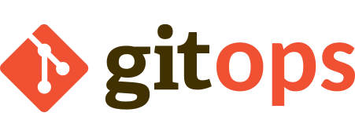

# A GitOps continuous deployment and delivery demonstrator using the Argo projects

 

## Description

This repository aims at presenting you a way to implement a **complete, automated and GitOps continuous deployment and delivery platform** combining together cloud-native opensource solutions: the Argo projects.

It will show you how you can **easily deploy your application** across different phases (test and production), **automatically validate and promote** an application version from one phase to the other, **run canary testing** in production to detect any defect and **automatically rollback** to the stable application version if that happens.

Let's meet the actors:

### Argo CD

Argo CD delivery tool for Kubernetes workloads implementing the [GitOps principles](https://opengitops.dev/#principles).

It's able to, declaratively, read definitions from a Git repository to deploy resources in many different target Kubernetes clusters, offering levels of abstraction allowing to keep the declarations as DRY as possible.

Documentation here: [https://argo-cd.readthedocs.io/en/stable/](https://argo-cd.readthedocs.io/en/stable/)

### Argo Workflows

Argo Workflows is a workflow engine, allowing to define and orchestrate jobs on Kubernetes.

Documentation here: [https://argo-workflows.readthedocs.io/en/latest/](https://argo-workflows.readthedocs.io/en/latest/)

### Argo Events

Argo Events is an eventing platform allowing to connect various event sources and associate them to trigger actions.

Documentation here: [https://argoproj.github.io/argo-events/](https://argoproj.github.io/argo-events/)

### Argo Rollouts

Argo Rollouts provides extensions to the basic Kubernetes rollouts, allowing to implement complex progressive rollouts mechanisms like canary or blue/green. It includes plugins to perform various analysis to detect any issue happening during the deployment.

Documentation here: [https://argo-rollouts.readthedocs.io/en/stable/](https://argo-rollouts.readthedocs.io/en/stable/)

## The project structure

The [`argo-projects`](https://github.com/OpenGuidou/argo-projects-demo/tree/main/argo-projects) folder contains all the manifests for the platform: the Argo CD application/applicationsets, the kubernetes resources for the Argo controllers, the infrastructure and the applications. For more informations, read the [platform manifests documentation](PLATFORM_MANIFESTS.md).

The [`demo-app`](https://github.com/OpenGuidou/argo-projects-demo/tree/main/demo-app/) folder contains the source code for the PetStore demo application, that we are using to demonstrate the deployment, promotion workflow and progressive rollouts mechanisms.

The [`ui`](https://github.com/OpenGuidou/argo-projects-demo/tree/main/ui/) folder contains the source code for the simple web page allowing to demonstrate the progressive rollout on the production version of the application.

The [`scripts`](https://github.com/OpenGuidou/argo-projects-demo/tree/main/scripts/) folder contains a few usefull scripts that you will use in the next chapters.

The [`workflow-resources`](https://github.com/OpenGuidou/argo-projects-demo/tree/main/workflow-resources/) contains the source code for the steps run during the promotion workflow.

The [`docs`](https://github.com/OpenGuidou/argo-projects-demo/tree/main/docs/) folder contains the project documentation.

## Installation

To setup this demonstrator, feel free to **fork this repository** and follow the [installation instructions](PLATFORM_INSTALLATION.md).

## Understand the platform manifests

See [the platform manifests documentation](PLATFORM_MANIFESTS.md).

## Promotion workflow

See [the promotion workflow doc](PROMOTION_WORKFLOW.md).

## Progressive rollout

See [the progressive rollout doc](PROGRESSIVE_ROLLOUT.md).

## Run the Demo

See [How to run the demo](HOW_TO_RUN_THE_DEMO.md).

## License

This project is licensed under the [Apache License](LICENSE).
